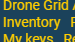
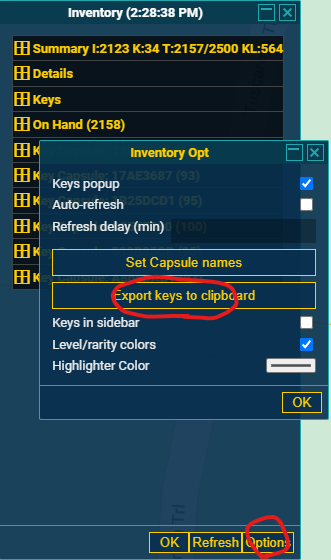

# Ingress Inventory Keys to KML

Install:

```bash
user@host:$ python3 -m venv ./venv
user@host:$ source venv/bin/activate
user@host:$ pip install -r requirments.txt
```

```bash
usage: keys.py [-h] -f FILENAME [-c CONFIG_FILENAME] [-k KML_FILENAME] [-o KEYS_FILENAME] [-i POLY_KEYS_FILENAME]

optional arguments:
  -h, --help            show this help message and exit
  -f FILENAME           Tab seperated file from inventory plugin export.
  -c CONFIG_FILENAME    Config File for BBOX
  -k KML_FILENAME       KML Filename
  -o KEYS_FILENAME      Filename for JSON formatted output
  -i POLY_KEYS_FILENAME
                        Filename for JSON formatted output of Keys in Polygon
```

Bounding Box creation with [Map Tool](https://www.keene.edu/campus/maps/tool/)
* Note: Coordinates are swapped, they are in lon,lat We expect them to be in lat,lon

```yml
bbox:
  - "40.7026674,-74.0055799"
  - "40.7027975,-74.0057516"
  - "40.7026348,-74.0049362"
  - "40.7029927,-74.0042496"
  - "40.7047170,-74.0011597"
  - "40.7059533,-73.9957094"
  - "40.7082630,-73.9888859"
  - "40.7118414,-73.9893150"
  - "40.7156473,-73.9901733"
  - "40.7206564,-73.9975548"
  - "40.7226404,-74.0024900"
  - "40.7233885,-74.0137768"
  - "40.7200384,-74.0166950"
  - "40.7170785,-74.0179825"
  - "40.7116462,-74.0193129"
  - "40.7061810,-74.0209007"
  - "40.7009430,-74.0199995"
  - "40.7000646,-74.0106010"
  - "40.7026674,-74.0055799"
```

Getting CSV contents:

* Have CORE
* Get the Inventory Plugin [Link](https://le-jeu.github.io/iitc-plugins/player-inventory.user.js)
* Click Inventory in side bar



* Click Refresh here first
* Click options
* Click "Export Keys to Clipboard"




Example:

```bash
(venv) user@hostname:~/ingress_key_poly$ python keys.py -f example.csv
IngressKeys::2023-06-15 14:23:14,767 - Ingress Keys - INFO - Portal "Portal Name For Portal 1" is inside the Polygon
IngressKeys::2023-06-15 14:23:14,767 - Ingress Keys - INFO - Portal "Portal Name For Portal 2" is inside the Polygon
IngressKeys::2023-06-15 14:23:14,767 - Ingress Keys - INFO - Portal "Portal Name For Portal 3" is inside the Polygon
IngressKeys::2023-06-15 14:23:14,767 - Ingress Keys - INFO - Portal "Portal Name For Portal 4" is inside the Polygon
IngressKeys::2023-06-15 14:23:14,768 - Ingress Keys - INFO - 4 Portals were found to reside inside the Polygon
IngressKeys::2023-06-15 14:23:14,768 - Ingress Keys - INFO - Saving KML file to output.kml
IngressKeys::2023-06-15 14:23:14,771 - Ingress Keys - INFO - Dumping Polygon Keys to ploy_keys.json
IngressKeys::2023-06-15 14:23:14,771 - Ingress Keys - INFO - Dumping all Keys to all_keys.json

```